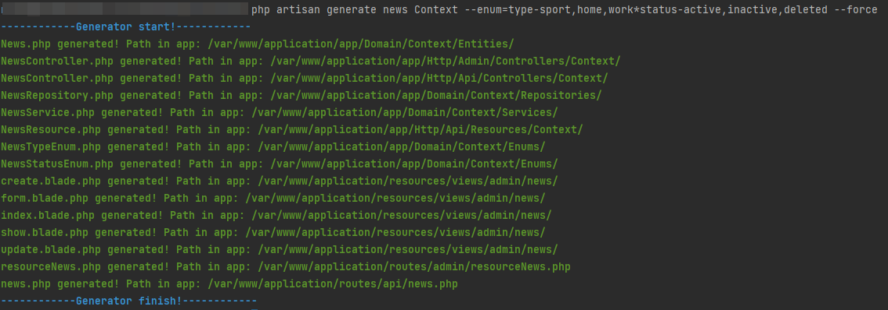
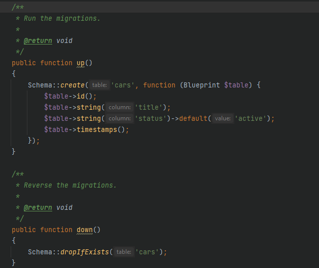

# Laravel Crud Generator

Проект создан быстрой генерации файлов для админки сайтов.
создаются файлы: Model, Repository, Service, Controller, view на основе указанной таблицы

Примеры кода будут выложены позже

#### Базовое использование:
**php artisan generate tableName {{path}} {{--enum}} {{--scenario}}**
{{path}} - Папка Domain в которую нужно складывать файлы
{{--enum}} - сгенерировать файлы enum
{{--force}} - по умолчанию false, при true заменяет текущие созданные файлы
{{--scenario=default}} - сценарий. default - генерация всех файлов, admin - генерация файлов для админ. панели, api - генерация файлов для апи
{{--action=generate}} - действие. generate - генерация файлов, rollback - удаление сгенерированных файлов
#### Вызов команды из кода:
Artisan::call('gen:all', [
'table' => 'event',
'--enum' => 'type-sport,home,work;status-active,inactive,deleted'
]);

#### Общие настройки конфигурации по желанию в файле .env

GENERATOR_BASE_NS= - базовый namespace, где хранятся Entities, Enum, Repository, Service
GENERATOR_HTTP_NS= - базовый namespace, где хранятся Controller

Папки для генерации файлов
GENERATOR_MODEL_FOLDER_NAME=
GENERATOR_REPOSITORY_FOLDER_NAME=
GENERATOR_ENUM_FOLDER_NAME=
GENERATOR_SERVICE_FOLDER_NAME=

Суффиксы для файлов
GENERATOR_REPOSITORY_SUFFIX=
GENERATOR_CONTROLLER_SUFFIX=
GENERATOR_SERVICE_SUFFIX=
GENERATOR_ENUM_STATUS_SUFFIX=
GENERATOR_VIEW_FILE_SUFFIX=

Родительские компоненты
GENERATOR_MODEL_EXTENDS=
GENERATOR_ADMIN_CONTROLLER_EXTENDS=
GENERATOR_API_CONTROLLER_EXTENDS=
GENERATOR_SERVICE_EXTENDS=
GENERATOR_SERVICE_IMPLEMENTS=
GENERATOR_REPOSITORY_EXTENDS=
GENERATOR_REPOSITORY_IMPLEMENTS=

Стандартный класс enum
GENERATOR_DEFAULT_STATUS_ENUM=App\Domain\Application\Admin\Enums\DefaultStatusEnum

При использовании своих файлов для генерации необходимо добавить в главный файл .gitignore папку:
/resources/views/generator
### Пример
**php artisan generate news Context --enum=type-sport,home,work;status-active,inactive,deleted --scenario=rollback --force**

## Быстрая генерация миграций
Начиная с версии 1.2.0 внедрен функционал быстрой миграции

Пример:
php artisan migrate:new create_news_table --fields=title:string:notNull,status
Создаст следующее содержимое

По-умолчанию используется файл fieldTemplates.json
Вы можете использовать свой набор шаблонов, достаточно скопировать файл в storage/app/fieldTemplates.json

Так же можно использовать готовый сценарий:
php artisan migrate:new create_news_table --scenario=news

После чего данные для миграции будут взяты из файла news.json. Сценарии также можно копировать в папку storage/app/ и писать свои сценарии.
